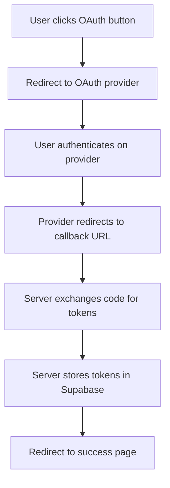
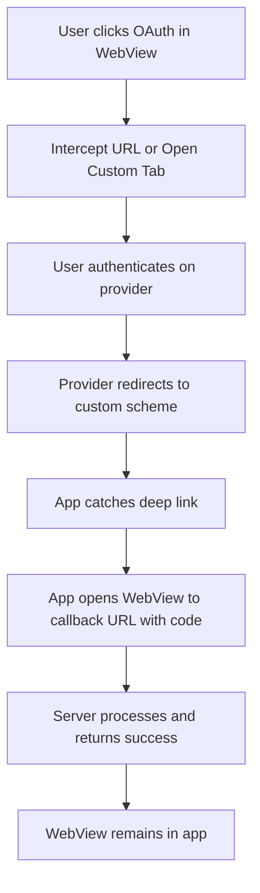

# Mobile App OAuth Integration with Deep Linking

## 📱 Overview

This guide explains how to integrate Game of Creators' OAuth flows (Google Sign-In/Sign-Up, Instagram, and YouTube connections) with a Flutter mobile app using WebView and deep linking. The goal is to keep users within the app experience without redirecting to external browsers.

---

## 🎯 Current Web Implementation

### Authentication Flows

#### 1. **Google OAuth (Sign-In/Sign-Up)**
- **Entry Point**: `/auth/signin` or `/auth/signup`
- **OAuth Callback**: `/auth/callback`
- **Final Redirect**: `/choose-username` (new users) or `/dashboard` (existing users)
- **Provider**: Supabase Auth with Google Provider
- **Scopes**: Profile, Email, YouTube access

#### 2. **Instagram Connection**
- **Entry Point**: `/dashboard/settings` (Connect Instagram button)
- **OAuth Callback**: `/api/instagram/callback`
- **Final Redirect**: `/dashboard/settings?success=instagram_connected`
- **Provider**: Instagram Basic Display API
- **Token Type**: Long-lived User Access Token (60 days)

#### 3. **YouTube Connection**
- **Entry Point**: `/dashboard/settings` (Connect YouTube button)
- **OAuth Callback**: `/api/youtube/callback`
- **Final Redirect**: `/dashboard/settings?success=youtube_connected`
- **Provider**: Google YouTube API v3
- **Scopes**: `youtube.readonly`

---

## 🔄 OAuth Flow Architecture

### Current Web Flow



### Proposed Mobile Flow with Deep Linking



---

## 📋 Implementation Requirements

### 1. Backend Modifications

#### A. Add Mobile-Specific Redirect URIs

You need to register additional redirect URIs for mobile app:

**For Google OAuth:**
```
Web: https://gameofcreators.com/auth/callback
Mobile: gameofcreators://auth/callback
```

**For Instagram:**
```
Web: https://gameofcreators.com/api/instagram/callback
Mobile: gameofcreators://instagram/callback
```

**For YouTube:**
```
Web: https://gameofcreators.com/api/youtube/callback
Mobile: gameofcreators://youtube/callback
```

#### B. Detect Mobile Platform

Add platform detection to serve appropriate redirect URIs:

**File: `lib/platform-utils.ts`** (Create this file)

```typescript
export type Platform = 'web' | 'ios' | 'android';

export function detectPlatform(userAgent: string): Platform {
  const ua = userAgent.toLowerCase();
  
  // Check for custom user agent set by Flutter app
  if (ua.includes('gameofcreators-mobile')) {
    if (ua.includes('android')) return 'android';
    if (ua.includes('ios') || ua.includes('iphone')) return 'ios';
  }
  
  return 'web';
}

export function getRedirectUri(platform: Platform, flow: 'google' | 'instagram' | 'youtube'): string {
  const baseUrl = process.env.NEXT_PUBLIC_APP_URL || 'https://gameofcreators.com';
  
  if (platform === 'web') {
    switch (flow) {
      case 'google':
        return `${baseUrl}/auth/callback`;
      case 'instagram':
        return `${baseUrl}/api/instagram/callback`;
      case 'youtube':
        return `${baseUrl}/api/youtube/callback`;
    }
  }
  
  // Mobile deep link scheme
  const scheme = 'gameofcreators://';
  switch (flow) {
    case 'google':
      return `${scheme}auth/callback`;
    case 'instagram':
      return `${scheme}instagram/callback`;
    case 'youtube':
      return `${scheme}youtube/callback`;
  }
}
```

#### C. Modify Google OAuth Flow

**File: `components/auth/SignInPage.tsx` & `SignUpPage.tsx`**

Update the `handleGoogleSignIn` function to detect mobile platform:

```typescript
const handleGoogleSignIn = async () => {
  setError(null);
  setIsGoogleLoading(true);

  try {
    // Detect if running in mobile WebView
    const isMobile = /gameofcreators-mobile/i.test(navigator.userAgent);
    const origin = window.location.origin;
    
    const redirectTo = isMobile 
      ? 'gameofcreators://auth/callback'
      : `${origin}/auth/callback`;

    const { data, error: signInError } = await supabase.auth.signInWithOAuth({
      provider: "google",
      options: {
        redirectTo: redirectTo,
        queryParams: {
          access_type: "offline",
          prompt: "consent",
        },
      },
    });

    if (signInError) {
      throw signInError;
    }

    // For mobile, the redirect will be caught by the app
    // For web, OAuth redirect will handle the rest
  } catch (err: any) {
    console.error("Google sign-in error:", err);
    setError(err.message || "Failed to sign in with Google");
    toast({
      variant: "destructive",
      title: "Google Access Failed",
      description: err.message || "Failed to sign in with Google. Please try again.",
      duration: TOAST_DURATION_MEDIUM,
    });
    setIsGoogleLoading(false);
  }
};
```

#### D. Modify Instagram Connection

**File: `app/dashboard/settings/client.tsx`**

Update the Instagram connection function:

```typescript
const handleInstagramConnect = async () => {
  setInstagramConnecting(true);
  try {
    const clientId = process.env.NEXT_PUBLIC_INSTAGRAM_CLIENT_ID;
    
    if (!clientId) {
      throw new Error("Instagram Client ID not configured");
    }

    // Detect if running in mobile WebView
    const isMobile = /gameofcreators-mobile/i.test(navigator.userAgent);
    const origin = window.location.origin;
    
    const redirectUri = isMobile
      ? 'gameofcreators://instagram/callback'
      : `${origin}/api/instagram/callback`;

    const authUrl = `https://api.instagram.com/oauth/authorize?client_id=${clientId}&redirect_uri=${encodeURIComponent(
      redirectUri
    )}&scope=user_profile,user_media&response_type=code`;

    // Store a flag to know we're returning from Instagram auth
    sessionStorage.setItem("instagram_auth_pending", "true");

    // For mobile, the app will handle the redirect
    // For web, redirect normally
    window.location.href = authUrl;
  } catch (error: any) {
    console.error("Error connecting Instagram:", error);
    toast({
      title: "Connection Failed",
      description: error.message || "Failed to connect Instagram account",
      variant: "destructive",
    });
    setInstagramConnecting(false);
  }
};
```

#### E. Modify YouTube Connection

**File: `app/dashboard/settings/client.tsx`**

Update the YouTube connection function:

```typescript
const handleYouTubeConnect = async () => {
  setYoutubeConnecting(true);
  try {
    // Detect if running in mobile WebView
    const isMobile = /gameofcreators-mobile/i.test(navigator.userAgent);
    
    const response = await fetch("/api/youtube/auth", {
      method: "POST",
      headers: {
        "Content-Type": "application/json",
      },
      body: JSON.stringify({
        platform: isMobile ? 'mobile' : 'web'
      })
    });

    if (!response.ok) {
      const errorData = await response.json();
      throw new Error(errorData.error || "Failed to initiate YouTube connection");
    }

    const { authUrl } = await response.json();

    // Store a flag to know we're returning from YouTube auth
    sessionStorage.setItem("youtube_auth_pending", "true");

    // For mobile, the app will handle the redirect
    // For web, redirect normally
    window.location.href = authUrl;
  } catch (error: any) {
    console.error("Error connecting YouTube:", error);
    toast({
      title: "Connection Failed",
      description: error.message || "Failed to connect YouTube account",
      variant: "destructive",
    });
    setYoutubeConnecting(false);
  }
};
```

#### F. Create YouTube Auth API Endpoint

**File: `app/api/youtube/auth/route.ts`** (Create this file)

```typescript
import { createOAuthClient, getAuthUrl } from '@/lib/youtube-api';
import { createClient } from '@/utils/supabase/server';
import { NextRequest, NextResponse } from 'next/server';
import crypto from 'crypto';
import { cookies } from 'next/headers';

export const dynamic = 'force-dynamic';

export async function POST(request: NextRequest) {
  try {
    const supabase = await createClient();
    
    const { data: { user }, error: userError } = await supabase.auth.getUser();
    
    if (userError || !user) {
      return NextResponse.json(
        { error: 'Not authenticated' },
        { status: 401 }
      );
    }

    const body = await request.json();
    const platform = body.platform || 'web'; // 'web', 'mobile'

    const oauth2Client = await createOAuthClient();
    
    // Set redirect URI based on platform
    const redirectUri = platform === 'mobile' 
      ? 'gameofcreators://youtube/callback'
      : `${process.env.NEXT_PUBLIC_APP_URL}/api/youtube/callback`;
    
    // Update OAuth client with correct redirect URI
    oauth2Client.redirectUri = redirectUri;

    const state = crypto.randomBytes(32).toString('hex');
    const cookieStore = await cookies();
    
    cookieStore.set({
      name: 'youtube_oauth_state',
      value: state,
      httpOnly: true,
      secure: process.env.NODE_ENV === 'production',
      sameSite: 'lax',
      maxAge: 60 * 10, // 10 minutes
      path: '/'
    });

    const authUrl = oauth2Client.generateAuthUrl({
      access_type: 'offline',
      scope: ['https://www.googleapis.com/auth/youtube.readonly'],
      prompt: 'consent',
      state: state
    });

    return NextResponse.json({ authUrl });
  } catch (error: any) {
    console.error('Error generating YouTube auth URL:', error);
    return NextResponse.json(
      { error: error.message || 'Failed to generate auth URL' },
      { status: 500 }
    );
  }
}
```

#### G. Update Callback Handlers to Support Mobile

**File: `app/auth/callback/route.ts`**

Add mobile redirect support:

```typescript
// After successful authentication, check platform
const userAgent = request.headers.get("user-agent") || "";
const isMobile = /gameofcreators-mobile/i.test(userAgent);

// At the end of the file, modify redirect logic:
if (isMobile) {
  // For mobile, redirect to deep link with success parameters
  const mobileRedirectUrl = `gameofcreators://auth/success?user_id=${user.id}&redirect=${encodeURIComponent(redirectPath)}`;
  return NextResponse.redirect(mobileRedirectUrl);
} else {
  // Web redirect
  return NextResponse.redirect(`${origin}${redirectPath}`);
}
```

**File: `app/api/instagram/callback/route.ts`**

Add at the end before success redirect:

```typescript
// Check if mobile platform
const userAgent = request.headers.get("user-agent") || "";
const isMobile = /gameofcreators-mobile/i.test(userAgent);

if (isMobile) {
  const mobileRedirectUrl = `gameofcreators://instagram/success?user_id=${user.id}`;
  return NextResponse.redirect(mobileRedirectUrl);
}
```

**File: `app/api/youtube/callback/route.ts`**

Add at the end before success redirect:

```typescript
// Check if mobile platform
const userAgent = request.headers.get("user-agent") || "";
const isMobile = /gameofcreators-mobile/i.test(userAgent);

if (isMobile) {
  const mobileRedirectUrl = `gameofcreators://youtube/success?user_id=${user.id}`;
  return NextResponse.redirect(mobileRedirectUrl);
}
```

---

### 2. OAuth Provider Configuration

#### A. Google Cloud Console

1. Go to [Google Cloud Console](https://console.cloud.google.com/)
2. Navigate to **APIs & Services** > **Credentials**
3. Edit your OAuth 2.0 Client ID
4. Add authorized redirect URIs:
   ```
   https://gameofcreators.com/auth/callback
   https://gameofcreators.com/api/youtube/callback
   gameofcreators://auth/callback
   gameofcreators://youtube/callback
   ```

#### B. Supabase Configuration

1. Go to [Supabase Dashboard](https://supabase.com/dashboard)
2. Navigate to **Authentication** > **URL Configuration**
3. Add redirect URLs:
   ```
   https://gameofcreators.com/auth/callback
   gameofcreators://auth/callback
   gameofcreators://auth/success
   ```

#### C. Instagram App Settings

1. Go to [Meta for Developers](https://developers.facebook.com/)
2. Select your Instagram app
3. Go to **Instagram Basic Display** > **Settings**
4. Add valid OAuth redirect URIs:
   ```
   https://gameofcreators.com/api/instagram/callback
   gameofcreators://instagram/callback
   gameofcreators://instagram/success
   ```

---

### 3. Flutter Mobile App Implementation

#### A. Set Up Deep Linking

**File: `android/app/src/main/AndroidManifest.xml`**

```xml
<manifest>
  <application>
    <activity android:name=".MainActivity">
      <!-- Existing intent filters -->
      
      <!-- Deep Link Intent Filter -->
      <intent-filter android:autoVerify="true">
        <action android:name="android.intent.action.VIEW" />
        <category android:name="android.intent.category.DEFAULT" />
        <category android:name="android.intent.category.BROWSABLE" />
        
        <!-- Custom scheme for OAuth callbacks -->
        <data android:scheme="gameofcreators" />
        <data android:host="auth" />
        <data android:host="instagram" />
        <data android:host="youtube" />
      </intent-filter>
    </activity>
  </application>
</manifest>
```

**File: `ios/Runner/Info.plist`**

```xml
<key>CFBundleURLTypes</key>
<array>
  <dict>
    <key>CFBundleTypeRole</key>
    <string>Editor</string>
    <key>CFBundleURLName</key>
    <string>com.gameofcreators.app</string>
    <key>CFBundleURLSchemes</key>
    <array>
      <string>gameofcreators</string>
    </array>
  </dict>
</array>

<!-- Allow OAuth URLs to be opened -->
<key>LSApplicationQueriesSchemes</key>
<array>
  <string>https</string>
  <string>http</string>
</array>
```

#### B. Add Required Dependencies

**File: `pubspec.yaml`**

```yaml
dependencies:
  flutter:
    sdk: flutter
  webview_flutter: ^4.4.0
  uni_links: ^0.5.1  # For deep link handling
  url_launcher: ^6.2.0  # For opening OAuth URLs
  flutter_inappwebview: ^6.0.0  # Alternative with better OAuth support
```

Run:
```bash
flutter pub get
```

#### C. Implement Deep Link Handler

**File: `lib/services/deep_link_service.dart`**

```dart
import 'dart:async';
import 'package:uni_links/uni_links.dart';
import 'package:flutter/services.dart';

class DeepLinkService {
  StreamSubscription? _sub;
  
  // Callback functions for different deep links
  Function(Uri)? onAuthCallback;
  Function(Uri)? onInstagramCallback;
  Function(Uri)? onYouTubeCallback;
  
  // Initialize deep link listener
  Future<void> initialize() async {
    // Check if app was opened with a deep link
    try {
      final initialUri = await getInitialUri();
      if (initialUri != null) {
        _handleDeepLink(initialUri);
      }
    } on PlatformException {
      // Handle exception
    }

    // Listen for deep links while app is running
    _sub = uriLinkStream.listen((Uri? uri) {
      if (uri != null) {
        _handleDeepLink(uri);
      }
    });
  }

  void _handleDeepLink(Uri uri) {
    print('Deep link received: $uri');
    
    // Route based on path
    if (uri.host == 'auth' || uri.path.contains('/auth/')) {
      onAuthCallback?.call(uri);
    } else if (uri.host == 'instagram' || uri.path.contains('/instagram/')) {
      onInstagramCallback?.call(uri);
    } else if (uri.host == 'youtube' || uri.path.contains('/youtube/')) {
      onYouTubeCallback?.call(uri);
    }
  }

  void dispose() {
    _sub?.cancel();
  }
}
```

#### D. Implement OAuth Handler in WebView

**File: `lib/screens/webview_screen.dart`**

```dart
import 'package:flutter/material.dart';
import 'package:flutter_inappwebview/flutter_inappwebview.dart';
import 'package:url_launcher/url_launcher.dart';
import '../services/deep_link_service.dart';

class WebViewScreen extends StatefulWidget {
  final String initialUrl;
  
  const WebViewScreen({Key? key, required this.initialUrl}) : super(key: key);

  @override
  State<WebViewScreen> createState() => _WebViewScreenState();
}

class _WebViewScreenState extends State<WebViewScreen> {
  InAppWebViewController? webViewController;
  final DeepLinkService _deepLinkService = DeepLinkService();
  bool _isLoading = true;

  @override
  void initState() {
    super.initState();
    _initializeDeepLinks();
  }

  void _initializeDeepLinks() {
    _deepLinkService.initialize();
    
    // Handle Google OAuth callback
    _deepLinkService.onAuthCallback = (uri) {
      print('Auth callback received: $uri');
      _handleAuthCallback(uri);
    };
    
    // Handle Instagram callback
    _deepLinkService.onInstagramCallback = (uri) {
      print('Instagram callback received: $uri');
      _handleSocialCallback(uri, 'Instagram');
    };
    
    // Handle YouTube callback
    _deepLinkService.onYouTubeCallback = (uri) {
      print('YouTube callback received: $uri');
      _handleSocialCallback(uri, 'YouTube');
    };
  }

  Future<void> _handleAuthCallback(Uri uri) async {
    // Extract parameters from deep link
    final redirect = uri.queryParameters['redirect'];
    final userId = uri.queryParameters['user_id'];
    
    if (redirect != null && userId != null) {
      // Navigate to the redirect path in WebView
      final redirectUrl = 'https://gameofcreators.com$redirect';
      await webViewController?.loadUrl(
        urlRequest: URLRequest(url: Uri.parse(redirectUrl))
      );
    }
  }

  Future<void> _handleSocialCallback(Uri uri, String platform) async {
    // Show success message
    ScaffoldMessenger.of(context).showSnackBar(
      SnackBar(content: Text('$platform connected successfully!')),
    );
    
    // Reload settings page to show connected account
    await webViewController?.loadUrl(
      urlRequest: URLRequest(
        url: Uri.parse('https://gameofcreators.com/dashboard/settings')
      )
    );
  }

  @override
  Widget build(BuildContext context) {
    return Scaffold(
      body: SafeArea(
        child: Stack(
          children: [
            InAppWebView(
              initialUrlRequest: URLRequest(
                url: Uri.parse(widget.initialUrl),
              ),
              initialOptions: InAppWebViewGroupOptions(
                crossPlatform: InAppWebViewOptions(
                  useShouldOverrideUrlLoading: true,
                  mediaPlaybackRequiresUserGesture: false,
                  javaScriptEnabled: true,
                  // Custom user agent to identify mobile app
                  userAgent: 'GameOfCreators-Mobile/${Platform.isAndroid ? "Android" : "iOS"}',
                ),
                android: AndroidInAppWebViewOptions(
                  useHybridComposition: true,
                ),
                ios: IOSInAppWebViewOptions(
                  allowsInlineMediaPlayback: true,
                ),
              ),
              onWebViewCreated: (controller) {
                webViewController = controller;
              },
              onLoadStart: (controller, url) {
                setState(() {
                  _isLoading = true;
                });
              },
              onLoadStop: (controller, url) async {
                setState(() {
                  _isLoading = false;
                });
              },
              shouldOverrideUrlLoading: (controller, navigationAction) async {
                final uri = navigationAction.request.url!;
                
                // Check if this is an OAuth URL
                if (_isOAuthUrl(uri)) {
                  // Open in external browser or custom tabs for OAuth
                  if (await canLaunchUrl(uri)) {
                    await launchUrl(
                      uri,
                      mode: LaunchMode.externalApplication,
                    );
                    return NavigationActionPolicy.CANCEL;
                  }
                }
                
                // Check if this is a deep link that should be handled
                if (uri.scheme == 'gameofcreators') {
                  return NavigationActionPolicy.CANCEL;
                }
                
                return NavigationActionPolicy.ALLOW;
              },
            ),
            if (_isLoading)
              const Center(
                child: CircularProgressIndicator(),
              ),
          ],
        ),
      ),
    );
  }

  bool _isOAuthUrl(Uri uri) {
    // Check if URL is an OAuth provider URL
    final oauthDomains = [
      'accounts.google.com',
      'api.instagram.com',
      'www.instagram.com',
    ];
    
    return oauthDomains.any((domain) => uri.host.contains(domain));
  }

  @override
  void dispose() {
    _deepLinkService.dispose();
    super.dispose();
  }
}
```

#### E. Main App Entry Point

**File: `lib/main.dart`**

```dart
import 'package:flutter/material.dart';
import 'screens/webview_screen.dart';

void main() {
  runApp(const MyApp());
}

class MyApp extends StatelessWidget {
  const MyApp({Key? key}) : super(key: key);

  @override
  Widget build(BuildContext context) {
    return MaterialApp(
      title: 'Game of Creators',
      theme: ThemeData(
        primarySwatch: Colors.purple,
        visualDensity: VisualDensity.adaptivePlatformDensity,
      ),
      home: const WebViewScreen(
        initialUrl: 'https://gameofcreators.com',
      ),
    );
  }
}
```

---

## 🔐 Environment Variables

Add to your `.env` or `.env.local`:

```env
# App URLs
NEXT_PUBLIC_APP_URL=https://gameofcreators.com
NEXT_PUBLIC_MOBILE_SCHEME=gameofcreators

# Google OAuth
GOOGLE_CLIENT_ID=your_google_client_id
GOOGLE_CLIENT_SECRET=your_google_client_secret

# Instagram
NEXT_PUBLIC_INSTAGRAM_CLIENT_ID=your_instagram_client_id
NEXT_PUBLIC_INSTAGRAM_CLIENT_SECRET=your_instagram_client_secret

# Supabase
NEXT_PUBLIC_SUPABASE_URL=your_supabase_url
NEXT_PUBLIC_SUPABASE_ANON_KEY=your_supabase_anon_key
SUPABASE_SERVICE_ROLE_KEY=your_supabase_service_role_key
```

---

## 🧪 Testing Guide

### 1. Test Google Sign-In/Sign-Up

#### Web (Control Test)
1. Open `https://gameofcreators.com/auth/signin`
2. Click "Continue with Google"
3. Complete Google authentication
4. Verify redirect to dashboard or username selection
5. Check that user is properly authenticated

#### Mobile App
1. Open Flutter app
2. Navigate to sign-in page in WebView
3. Click "Continue with Google"
4. **Expected**: Opens Chrome Custom Tab (Android) or Safari (iOS)
5. Complete Google authentication
6. **Expected**: App receives `gameofcreators://auth/callback?code=...`
7. **Expected**: Deep link handler processes and navigates to correct page
8. Verify user is authenticated in WebView

### 2. Test Instagram Connection

#### Web (Control Test)
1. Sign in to dashboard
2. Go to Settings > Social Accounts
3. Click "Connect Instagram"
4. Authenticate on Instagram
5. Verify account shows as connected with profile info

#### Mobile App
1. Open app and navigate to Settings
2. Click "Connect Instagram"
3. **Expected**: Opens Instagram OAuth in external browser
4. Complete Instagram authentication
5. **Expected**: Redirects to `gameofcreators://instagram/success`
6. **Expected**: App catches deep link and shows success message
7. **Expected**: WebView reloads settings page showing connected account

### 3. Test YouTube Connection

#### Web (Control Test)
1. Sign in to dashboard
2. Go to Settings > Social Accounts
3. Click "Connect YouTube"
4. Authenticate with Google
5. Grant YouTube permissions
6. Verify channel shows as connected

#### Mobile App
1. Open app and navigate to Settings
2. Click "Connect YouTube"
3. **Expected**: Opens Google OAuth in external browser
4. Complete authentication and grant permissions
5. **Expected**: Redirects to `gameofcreators://youtube/success`
6. **Expected**: App catches deep link
7. **Expected**: Settings page reloads showing connected YouTube channel

### 4. Test Edge Cases

#### Scenario 1: User Cancels OAuth
- **Action**: User clicks back/cancel during OAuth
- **Expected**: Returns to app without error
- **Verify**: App shows original screen, no crash

#### Scenario 2: OAuth Error
- **Action**: Simulate OAuth error (invalid scope, etc.)
- **Expected**: Error message displayed in app
- **Verify**: User can retry authentication

#### Scenario 3: Expired Tokens
- **Action**: Wait for token expiry or manually expire tokens
- **Expected**: Auto-refresh mechanism triggers
- **Verify**: Tokens are refreshed without user action

#### Scenario 4: Multiple Social Accounts
- **Action**: Connect Instagram, then YouTube, then try Google
- **Expected**: All accounts connect independently
- **Verify**: All accounts show as connected in settings

#### Scenario 5: Disconnection
- **Action**: Disconnect social accounts from settings
- **Expected**: Account removed, reconnection available
- **Verify**: Can reconnect same or different account

---

## 📊 OAuth Flow Comparison

| Aspect | Web Implementation | Mobile Implementation |
|--------|-------------------|----------------------|
| **Google Sign-In** | Redirect to Supabase OAuth | Open Custom Tab → Deep Link |
| **Instagram Connect** | Redirect to Instagram | Open External Browser → Deep Link |
| **YouTube Connect** | Redirect to Google | Open Custom Tab → Deep Link |
| **Redirect URI** | `https://domain.com/callback` | `gameofcreators://callback` |
| **Session Management** | Cookies + Supabase | Cookies + Supabase (same) |
| **Token Storage** | Supabase Database | Supabase Database (same) |
| **User Experience** | Leaves website temporarily | Stays in app context |

---

## 🔒 Security Considerations

### 1. Deep Link Validation

Always validate deep links to prevent malicious redirects:

```typescript
// Backend: Validate state parameter
const state = searchParams.get('state');
const storedState = cookies.get('oauth_state');

if (state !== storedState) {
  throw new Error('Invalid OAuth state');
}
```

### 2. Custom User Agent

Set a unique user agent for your mobile app:

```dart
userAgent: 'GameOfCreators-Mobile/1.0.0 (Android/iOS)'
```

This helps:
- Detect mobile platform on backend
- Prevent user agent spoofing
- Track mobile vs web usage
- Serve appropriate responses

### 3. SSL/TLS Pinning (Optional but Recommended)

Implement certificate pinning to prevent man-in-the-middle attacks:

```dart
// In flutter_inappwebview options
certificateTransparency: true,
```

### 4. Token Security

- ✅ Store tokens only in Supabase (server-side)
- ✅ Never expose tokens in URL parameters
- ✅ Use short-lived access tokens with refresh tokens
- ✅ Implement token rotation
- ❌ Don't store tokens in mobile app local storage

### 5. Rate Limiting

Implement rate limiting for OAuth endpoints to prevent abuse:

```typescript
// Example using middleware
import { rateLimit } from '@/lib/rate-limit';

export async function POST(request: NextRequest) {
  const ip = request.headers.get('x-forwarded-for') || 'unknown';
  
  const rateLimitResult = await rateLimit(ip, {
    interval: 60000, // 1 minute
    uniqueTokenPerInterval: 500,
  });

  if (!rateLimitResult.success) {
    return NextResponse.json(
      { error: 'Rate limit exceeded' },
      { status: 429 }
    );
  }
  
  // Continue with OAuth logic...
}
```

---

## 🐛 Troubleshooting

### Issue 1: Deep Link Not Opening App

**Symptoms:**
- OAuth callback doesn't open app
- Browser shows "Page not found"

**Solutions:**
1. Verify deep link scheme in `AndroidManifest.xml` and `Info.plist`
2. Check redirect URI matches exactly (including scheme, host, path)
3. Ensure app is installed on device
4. Test with `adb shell am start -W -a android.intent.action.VIEW -d "gameofcreators://auth/callback"`

### Issue 2: Platform Detection Not Working

**Symptoms:**
- Mobile users getting web redirect URIs
- "Invalid redirect URI" errors

**Solutions:**
1. Verify custom user agent is being set in Flutter WebView
2. Check backend is reading `User-Agent` header correctly
3. Add logging to track which platform is detected
4. Ensure user agent includes `gameofcreators-mobile`

### Issue 3: OAuth Loop (Infinite Redirects)

**Symptoms:**
- User keeps getting redirected to OAuth provider
- Never completes authentication

**Solutions:**
1. Clear app data and cookies
2. Check state parameter validation
3. Verify callback URL is registered in OAuth provider
4. Ensure session is being created properly
5. Check for cookie issues (SameSite attribute)

### Issue 4: Token Not Saved

**Symptoms:**
- OAuth completes but user not authenticated
- Social account not showing as connected

**Solutions:**
1. Check Supabase RLS policies allow inserts/updates
2. Verify user session exists when updating profile
3. Check database logs for failed queries
4. Ensure callback handler is processing tokens correctly

### Issue 5: Instagram Token Expires Too Quickly

**Symptoms:**
- Instagram disconnects frequently
- Token expiry warnings

**Solutions:**
1. Verify long-lived token exchange is happening (should be 60 days)
2. Check automatic token refresh logic
3. Implement token refresh before expiry (check at app startup)
4. Log token expiry dates to debug

### Issue 6: YouTube Permissions Not Sufficient

**Symptoms:**
- Can't fetch videos
- API errors about permissions

**Solutions:**
1. Verify scopes include `youtube.readonly`
2. Check OAuth consent screen approved all scopes
3. Ensure `access_type: 'offline'` is set
4. Verify refresh token is being saved
5. Re-authenticate if scopes changed

---

## 📝 Checklist for Production

### Backend

- [ ] Add mobile redirect URIs to all OAuth providers (Google, Instagram)
- [ ] Update Supabase redirect URL configuration
- [ ] Implement platform detection in auth flows
- [ ] Modify callback handlers to support mobile deep links
- [ ] Add logging for mobile authentication events
- [ ] Test token refresh logic for both platforms
- [ ] Set up monitoring for OAuth failures
- [ ] Configure rate limiting on OAuth endpoints
- [ ] Update CORS settings if needed
- [ ] Add user agent validation

### Mobile App

- [ ] Configure deep link scheme in Android manifest
- [ ] Configure URL types in iOS Info.plist
- [ ] Implement deep link handler service
- [ ] Set custom user agent in WebView
- [ ] Handle OAuth redirects (open external browser)
- [ ] Catch and process deep link callbacks
- [ ] Show loading states during OAuth
- [ ] Display error messages for failed auth
- [ ] Test on both Android and iOS
- [ ] Test with different Android/iOS versions
- [ ] Implement token refresh checks
- [ ] Add analytics for OAuth events
- [ ] Handle network errors gracefully
- [ ] Test app store build (not just debug)

### Testing

- [ ] Test Google Sign-In on mobile
- [ ] Test Google Sign-Up on mobile
- [ ] Test Instagram connection on mobile
- [ ] Test YouTube connection on mobile
- [ ] Test disconnecting and reconnecting accounts
- [ ] Test with poor network conditions
- [ ] Test OAuth cancellation flow
- [ ] Test expired token scenarios
- [ ] Test multiple accounts (Instagram + YouTube)
- [ ] Verify web flows still work (regression test)
- [ ] Test on fresh install (no cached data)
- [ ] Test after app update
- [ ] Load test with multiple concurrent users

### Documentation

- [ ] Document mobile-specific environment variables
- [ ] Update API documentation with platform parameter
- [ ] Create mobile app setup guide for developers
- [ ] Document deep link scheme for QA team
- [ ] Add troubleshooting guide for support team
- [ ] Update user-facing help docs

---

## 🚀 Deployment Steps

### 1. Backend Deployment

```bash
# 1. Update environment variables in production
# Add NEXT_PUBLIC_MOBILE_SCHEME=gameofcreators

# 2. Deploy backend changes
git add .
git commit -m "feat: Add mobile deep linking support for OAuth"
git push origin main

# 3. Verify deployment
curl -I https://gameofcreators.com/api/youtube/auth
```

### 2. OAuth Provider Updates

#### Google Cloud Console
1. Add mobile redirect URIs
2. Update consent screen if needed
3. Verify changes in OAuth settings
4. Test with OAuth playground

#### Meta for Developers (Instagram)
1. Add mobile redirect URIs to Instagram app
2. Submit for review if needed (basic permissions usually auto-approved)
3. Verify in app settings

#### Supabase
1. Update redirect URLs in dashboard
2. Test authentication in Supabase auth UI
3. Verify RLS policies

### 3. Mobile App Deployment

```bash
# Build Android APK
cd mobile_app
flutter build apk --release

# Build iOS
flutter build ios --release

# Test locally first
flutter run --release
```

### 4. Verification

1. Test all OAuth flows on staging/test environment
2. Monitor error logs during initial rollout
3. Implement feature flag for gradual rollout
4. Collect user feedback
5. Monitor analytics for completion rates

---

## 📚 Additional Resources

### Documentation

- [Supabase OAuth Documentation](https://supabase.com/docs/guides/auth/social-login)
- [Google OAuth 2.0 Guide](https://developers.google.com/identity/protocols/oauth2)
- [Instagram Basic Display API](https://developers.facebook.com/docs/instagram-basic-display-api)
- [YouTube Data API](https://developers.google.com/youtube/v3)
- [Flutter Deep Linking](https://docs.flutter.dev/development/ui/navigation/deep-linking)
- [Android App Links](https://developer.android.com/training/app-links)
- [iOS Universal Links](https://developer.apple.com/ios/universal-links/)

### Code Examples

- [Flutter WebView OAuth Example](https://github.com/flutter/plugins/tree/main/packages/webview_flutter)
- [Flutter Deep Link Example](https://github.com/flutter/plugins/tree/main/packages/uni_links)
- [Next.js OAuth Example](https://github.com/vercel/next.js/tree/canary/examples/with-supabase-auth)

### Support

- **Backend Issues**: Check Supabase logs and Next.js console
- **Mobile Issues**: Check Flutter logs with `flutter logs`
- **OAuth Provider Issues**: Check provider dashboard logs
- **Deep Link Issues**: Use Android Studio / Xcode debugger

---

## 📞 Contact & Support

For issues or questions:

1. **Technical Issues**: Check troubleshooting section above
2. **OAuth Provider Issues**: Refer to provider documentation
3. **Mobile App Issues**: Check Flutter logs and deep link configuration
4. **Backend Issues**: Check server logs and Supabase dashboard

---

## 🎯 Summary

This guide provides a complete implementation for integrating OAuth flows with a Flutter mobile app using deep linking. Key points:

✅ **For Google Sign-In/Sign-Up**: Use custom scheme redirects with Supabase OAuth
✅ **For Instagram**: Open OAuth in external browser, catch deep link callback  
✅ **For YouTube**: Similar to Instagram with Google OAuth
✅ **For Security**: Validate deep links, use state parameters, implement rate limiting
✅ **For Testing**: Test all flows on both platforms, handle edge cases
✅ **For Production**: Update all OAuth providers, deploy backend and mobile app

The implementation maintains backward compatibility with web flows while adding seamless mobile support.

---

**Last Updated**: December 13, 2025
**Version**: 1.0.0
**Status**: Ready for Implementation
